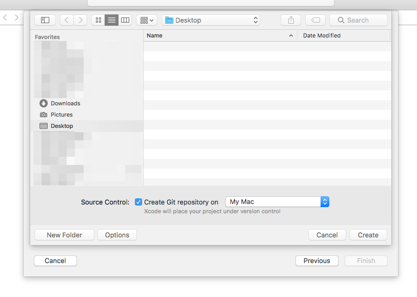
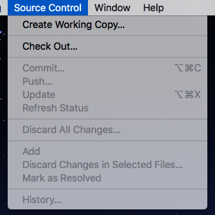
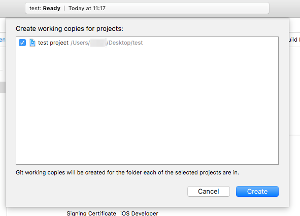
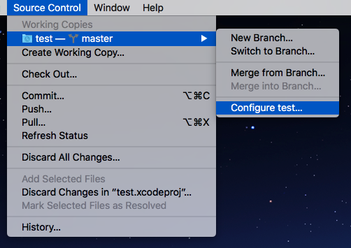

## Git

バージョン管理システムのひとつ。

- ファイルやフォルダの変更履歴を管理する

  **なぜ重要?**
  - 以前の状態に戻したい → トライ＆エラー

- プロジェクトをチーム (複数の人数) で進める場合のファイル・フォルダ管理

  **なぜ重要?**
  - 同じファイルを別の人がほぼ同時に編集していた → 変更の重複や衝突を管理

### リポジトリ

repository [1](#ref-repository)

> 1. 容器; «…の» 貯蔵[保管, 収納]所 «of, for» .
> 2. (知識資源などの)宝庫; 物知り, 生き字引き.

Git では「作業場」のこと。手元の作業場を「ローカルリポジトリ」、GitHub などのサーバ上の共有スペースに仮置きしてある作業場を「リモートリポジトリ」と呼ぶ。

### ローカルリポジトリ

手元の作業場のこと。

Xcode でプロジェクトを新規作成する時に `Create Git repository on "My Mac"` をチェックしておくとローカルリポジトリも作成されます。

#### 今使っているプロジェクトに対してローカルリポジトリがあるかどうかを確認する方法

`Source Control` メニューを開きます。 `Working Copies` がなく、最初のメニューが `Create Working Copy...` になっている場合、まだローカルリポジトリが作成されていない状態です。

この状態で `Create Working Copy ...` を押すと、確認ダイアログが表示されます。

`Create` ボタンを押せば、ローカルリポジトリが作成されます。

### リモートレポジトリ

上記手順でローカルリポジトリを作成した際、リモートリポジトリは作成されていない (あるいはどのリモートリポジトリとも繋がっていない) 状態になっています。

`Source Control` メニューから現在のローカルリポジトリを選択して `Configure XXX ...` (ここで `XXX` はローカルリポジトリ名) を選択します。

表示された設定ダイアログより `Add Remote ...` を選んでリモートリポジトリを設定します。

****

<a id="ref-repository">[1]</a>: ウィズダム英和辞典から引用 (Copyright © 2007, 2013 Sanseido Company Ltd.)
